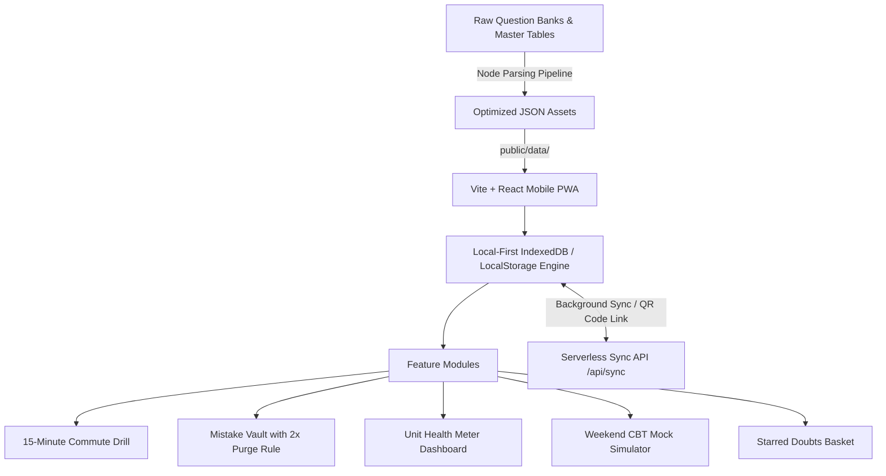

# Implementation Plan: "ExamVault" (VaultJRF) — Personal Exam Revision & Mastery App

Build a mobile-first, high-performance web application tailored for UGC-NET (English Literature & Paper 1) aspirants to bridge scores to **210+ / 300** (guaranteed JRF & top rank). The application replaces bulky PDFs with an ultra-fast, 1-tap mobile revision drill featuring instant cheat-sheet explanations, an automated Mistake Vault, a CBT Weekend Mock Simulator, a Unit Health Meter, and seamless passwordless cloud sync.

---

## User Review Required

> [!important] **Workspace Location & Structure**
> The project will be built directly inside the workspace: `/home/yuzaga/Code/ExamVault`.
> All frontend components, build configs, parsing scripts, and bundled question data will reside cleanly within this repository.

> [!important] **Question Bank Scope & Packaging**
> - **Paper 2 (English Literature):** All **1,295 authentic NTA questions** across all 10 units (14 shifts, 2020–2024) with official NTA keys and cheat-sheet rules from the Master Tables.
> - **Paper 1 (General Aptitude):** Complete unit-by-unit bank with priority on modern CBT questions (covering Units 1–10, including Teaching Aptitude, Research, Logical Reasoning, ICT, Higher Education, People & Environment), bundled into modular JSON files for instant mobile loading.

---

## Proposed Architecture & Tech Stack



1. **Frontend Core:**
   - **Framework:** Vite + React (TypeScript) for instant builds, sub-second hot reloading, and zero mobile hydration lag.
   - **Styling:** Custom Vanilla CSS Design System (`index.css` & component styles) adhering to strict design rules:
     - Curated, eye-catching color palette (Deep navy/slate dark theme, vibrant emerald green for success, coral red for errors, amber for warning, royal violet for mocks).
     - Modern typography using Google Fonts (*Outfit* + *Plus Jakarta Sans*).
     - Glassmorphic card surfaces, tactile thumb-friendly tap targets ($\ge 52\text{px}$ height), micro-animations, and fluid transitions.
   - **Audio & Haptics:** Web Audio API sound synthesizer (pure procedural chimes and tones with zero audio download lag) + `navigator.vibrate` for tactile feedback on Android/iOS.
   - **PWA Capabilities:** App manifest and service worker configuration for instant 1-tap "Add to Home Screen" on mobile.

2. **Data Processing Pipeline:**
   - Standalone extraction script `scripts/parse-questions.js`:
     - Parses markdown question files from Paper 2 (all 10 units).
     - Parses markdown question files from Paper 1 (all 10 units, categorized by modern shifts).
     - Ingests high-yield rules and matrices from `Paper_2_English_Literature_Master_Tables.md` and `Unit_Wise_Action_Plan.md`.
     - Cross-references keywords/topics in questions to attach exact 1-line "Cheat Sheet Rules" (e.g. *Coiner vs. Popularizer*, *Hetvabhasa types*, *Positivism vs. Interpretivism*, *GHG GWP ranks*).
     - Emits chunked JSON files into `public/data/` for rapid asynchronous loading.

3. **State Management & Persistence:**
   - Local-first architecture using `IndexedDB` with fallback to `localStorage`. Works 100% offline on commutes and weak connectivity.
   - Automatic background syncing to `/api/sync` whenever online.
   - Passwordless Multi-Device Sync: Unique Device Sync ID + 1-click shareable URL (e.g. `?sync=<token>`) + dynamic QR code for instant transition between devices.

---

## Key Feature Specifications

### 1. The "Commute Drill & Custom Test Builder" (Maximum Flexibility)
- **Unit Selector & Multi-Unit Combining:**
  - Quick single unit selection (e.g. Unit 1 Drama or Unit 6 Logical Reasoning).
  - Multi-unit combination selector: Choose any combination of units across Paper 1 or Paper 2 (e.g., combine *Units 1, 2 & 8* or all weak units identified by the Health Meter).
  - "Select All" / "Clear All" / "Only Leak Units (<60%)" quick presets.
- **Session Goals (Count or Time Based):**
  - **By Question Count:** 5, 10, 15, 20, 25, 30, 50 questions.
  - **By Time Budget (e.g., 25 Minutes):** Select 10, 15, 20, 25, 30, 45, or 60 minutes. The builder calculates the standard NTA exam pace (~1.2 mins/question, so a 25-minute drill automatically serves ~20 questions), or allows manual question count adjustment.
- **Execution Modes:**
  - *Instant Feedback Practice Mode:* Card UI with thumb-friendly `(A)`, `(B)`, `(C)`, `(D)` buttons, instant emerald/coral glow, procedural sound synthesis, and the 1-line Master Table cheat-sheet rule popover.
  - *Timed Exam Mode:* Live countdown timer, authentic NTA palette (Answered, Marked for Review, Unattempted), question drawer navigation, and end-of-drill scorecard with 1-tap "Send errors to Mistake Vault".
- **Quick Action Bar:** Star button (add to Doubt Basket), Next/Previous button, and real-time pace/time indicator.


### 2. The Mistake Vault ("My Mistakes")
- **Automated Logging:** Every question answered incorrectly in any drill or mock is immediately captured into the Mistake Vault with timestamp and failure count.
- **Prominent Home Badge:** High-visibility banner on home screen: *"Practice My Mistakes (X Questions Waiting)"*.
- **The "2x Consecutive Purge" Rule:**
  - A mistake question remains in the vault until answered correctly **twice in a row** across practice sessions.
  - When answered correctly twice, a celebration animation triggers and the question is permanently marked as "Conquered".
- **Filtering:** Filter vault questions by Paper 1 vs Paper 2 or specific unit.

### 3. The Unit "Health Meter" (Confidence Dashboard)
- Color-coded visual status for all 20 units (10 Paper 1 + 10 Paper 2):
  - 🟢 **Green ($\ge 80\%$ accuracy):** *"Exam Ready — Safe!"*
  - 🟡 **Yellow ($60\% - 79\%$ accuracy):** *"Good — Needs 1 More Drill"*
  - 🔴 **Red ($< 60\%$ accuracy):** *"Leak Detected — Practice This Unit Today!"*
- Displays total attempted, correct, accuracy percentage, and a direct 1-tap **"Drill This Unit"** button.

### 4. The Weekend Mock Simulator (Real CBT Experience)
- **Presets:**
  - **Paper 1 Full Mock:** 50 authentic questions, 60-minute countdown timer.
  - **Paper 2 Full Mock:** 100 authentic questions, 120-minute countdown timer.
- **Authentic NTA CBT Palette:**
  - 🟢 Answered
  - 🟣 Marked for Review
  - 🟣🟢 Answered & Marked for Review
  - ⚪ Unvisited / Not Answered
- **Question Palette Drawer:** Floating mobile drawer allowing 1-tap navigation to any question.
- **Submission & Scorecard:**
  - Total Score out of 100 or 200 marks.
  - Percentile / accuracy breakdown.
  - Time spent per question.
  - 1-tap *"Send all failed questions to Mistake Vault"*.
  - Full Question Review mode with answer explanations.

### 5. "Star for Revision" (Doubt Basket)
- 1-tap star icon accessible on every question screen.
- Doubt Basket page organized by unit with optional user notes.
- Quick share/export button to copy questions and doubts to clipboard for mentor/peer discussion.

### 6. Daily Routine Tracker
- Interactive daily checklist aligned with candidate study routines:
  - 🚌 Morning Commute: 10 Qs Paper 1 Drill
  - 🍎 Midday Break: 5 Qs Mistake Vault
  - 🌙 Evening Study: 15 Qs Paper 2 Literature Drill
  - 📅 Weekend: Timed Mock Simulation
- Daily streak counter (🔥 Flame counter) to encourage continuous momentum.

### 7. Passwordless Cloud Sync & Multi-Device Support
- **Automatic Device Profile:** Unique anonymous ID generated on first open.
- **Sync Serverless API (`api/sync.ts`):** Handles storage and retrieval of user state (mistakes, stars, drill history, streaks).
- **1-Click Sync Link & QR Code:** In Settings, a QR code and copyable sync link allow opening the exact same state on desktop or a new phone in 5 seconds.
- **Offline Reliability:** Full service-worker caching for question JSONs and core assets; sync queued until connection is re-established.

---

## Proposed Project Structure

```
ExamVault/
├── api/
│   └── sync.ts                     # Serverless Function for cloud sync
├── scripts/
│   ├── parse-questions.js          # Ingests markdown banks + Master Tables into JSON
│   └── test-parser.js              # Verification script
├── public/
│   ├── data/
│   │   ├── manifest.json           # Units, question counts, shift metadata
│   │   ├── rules.json              # Master Table cheat sheet rules
│   │   ├── paper2_unit01.json ...  # Paper 2 units (1,295 questions)
│   │   └── paper1_unit01.json ...  # Paper 1 units (High-yield sets)
│   ├── favicon.svg
│   ├── icon-192.png
│   ├── icon-512.png
│   ├── manifest.json               # Web App Manifest for PWA
│   └── sw.js                       # Service Worker for offline drills
├── src/
│   ├── assets/
│   ├── components/
│   │   ├── CommuteDrill.tsx        # 10-Q mobile drill card & thumb buttons
│   │   ├── MistakeVault.tsx        # Mistake clearing mode & streak logic
│   │   ├── HealthMeter.tsx         # Color-coded unit health confidence meters
│   │   ├── MockSimulator.tsx       # Timed CBT simulator with NTA palette
│   │   ├── StarredDoubtList.tsx    # Doubt basket & notes
│   │   ├── RoutineTracker.tsx      # Daily routine checklist & streaks
│   │   ├── BottomNav.tsx           # Mobile bottom navigation bar
│   │   ├── SyncModal.tsx           # QR Code & multi-device sync
│   │   └── ExplanationCard.tsx     # 1-line cheat sheet rule popover
│   ├── services/
│   │   ├── audioService.ts         # Web Audio API procedural sound synthesizer
│   │   ├── storageService.ts       # Local-first IndexedDB / LocalStorage
│   │   ├── syncService.ts          # Background cloud sync client
│   │   └── questionService.ts      # Lazy data loader & randomizer
│   ├── types/
│   │   └── index.ts                # Question, Attempt, Mistake, UnitHealth types
│   ├── App.tsx                     # Main layout & router
│   ├── index.css                   # Premium CSS design system
│   └── main.tsx                    # React root
├── index.html                      # Mobile-optimized HTML with viewport meta
├── package.json
├── tsconfig.json
├── vite.config.ts
└── vercel.json                     # Deployment configuration
```

---

## Verification Plan

### Automated Verification
1. **Data Parsing Integrity:** Run `node scripts/parse-questions.js` and assert:
   - All 1,295 Paper 2 questions parsed with non-empty questions, valid options (A-D), and correct answer keys.
   - Paper 1 units parsed with 100% answer key coverage.
   - Master Table rules properly indexed.
2. **Build Verification:** Run `npm run build` to ensure TypeScript compilation passes and production bundle is created with zero errors.

### Manual Verification
1. **Commute Drill:** Verify 10-question drill flow, option selection, green/red feedback, cheat sheet explanation popup, sound playback, and haptic vibration.
2. **Mistake Vault:** Intentionally fail 2 questions $\to$ verify they appear in Mistake Vault $\to$ drill them once correctly (streak = 1) $\to$ drill a second time correctly (streak = 2) $\to$ verify they are purged from the vault.
3. **Health Meter:** Verify unit accuracy changes dynamically based on drill results with proper green/yellow/red color-coding.
4. **CBT Mock Simulator:** Launch Paper 1 (50 Qs) or Paper 2 (100 Qs) mock $\to$ verify countdown timer, question palette state updates, submission dialog, and detailed scorecard generation.
5. **Sync & PWA:** Test offline drill behavior, test QR code / sync token generation, verify web app manifest.
