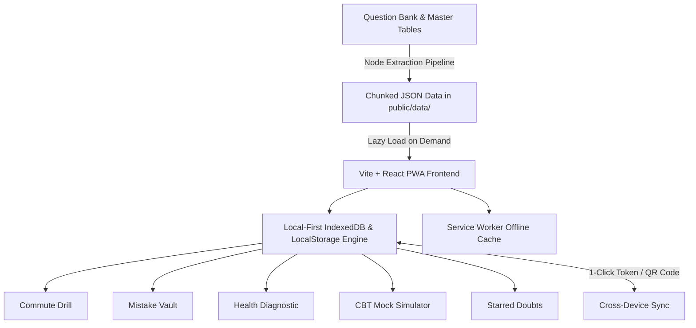

<div align="center">

# ⚡ ExamVault (VaultJRF)
### High-Performance Personal Exam Revision & CBT Mock Simulator for UGC-NET / JRF Aspirants

[](https://reactjs.org/)
[](https://www.typescriptlang.org/)
[](https://vitejs.dev/)
[](https://web.dev/progressive-web-apps/)
[](https://vercel.com/)
[](#-question-bank-coverage)

*Designed to replace bulky 400-page PDFs with high-velocity 1-tap phone drills, instant cheat-sheet rules, automated mistake purging, and full-length CBT mock simulations to bridge scores to **210+ / 300**.*

---

</div>

## 🌟 Why ExamVault?

| Real-Life Bottleneck | How ExamVault Solves It |
| :--- | :--- |
| **No Time for Long Study Hours:** Working professionals and busy candidates cannot sit for 6 continuous hours every day. | **10-Minute Commute Drills:** Designed around 5–15 minute daily micro-sessions on buses, trains, and lunch breaks. |
| **Repeated Mistakes (The Plateau):** Aspirants repeatedly miss JRF cutoffs by 2–4 marks due to the same recurring examiner trap patterns. | **The Mistake Vault (2x Purge Rule):** Automatically traps missed questions and forces mastery by requiring 2 consecutive correct attempts to purge them. |
| **High Friction of Books & PDFs:** Scrolling through PDFs, scribbling answers on scrap paper, and searching answer keys causes mental fatigue. | **Instant 1-Tap Interaction:** Read question $\to$ tap option $\to$ procedural audio feedback + exact Master Table cheat-sheet rule in <1 second. |

---

## 🚀 Key Features

### 1. ⚡ Commute Drill & Custom Test Builder
- **Flexible Unit Selection:** Drill a single unit or freely combine multiple units across Paper 1 and Paper 2 (e.g. *Drama + Poetry* or *Logical Reasoning + ICT*).
- **Weak Unit 1-Tap Preset:** Instantly extracts and targets your lowest accuracy units based on diagnostic health data.
- **Session Goals:** Drill by question count (5, 10, 15, 20, 25 Qs) or time budget (10, 15, 20, 25, 30 mins) matching standard NTA pacing (~1.25 min/Q).
- **Dual Modes:**
  - *Practice Mode:* Instant emerald/coral feedback, procedural sound synthesis, and the Master Cheat Sheet rule.
  - *Exam Mode:* Live countdown timer, answers hidden until completion, and full scorecard generation.

### 2. 🛡️ The Mistake Vault ("My Mistakes")
- **Automated Logging:** Every question answered incorrectly across any drill or CBT mock is captured into the vault.
- **The 2x Consecutive Purge Rule:** A question remains in the vault with an active failure counter until answered correctly **twice in a row** (`● ○ 1/2` $\to$ `● ● Conquered!`).
- **Targeted Practice:** Filter mistakes by Paper 1, Paper 2, or drill individual questions on-demand.

### 3. 📊 Unit Health & Confidence Diagnostic Meter
- Color-coded diagnostic overview for all 20 units (10 Paper 1 + 10 Paper 2):
  - 🟢 **Safe ($\ge 80\%$ Accuracy):** *"Exam Ready — Safe!"*
  - 🟡 **Warning ($60\% - 79\%$ Accuracy):** *"Needs Practice — Drill Again"*
  - 🔴 **Leak ($< 60\%$ Accuracy):** *"Leak Detected — Practice This Unit Today!"*
- Direct 1-tap **"Drill Unit"** button for immediate reinforcement.

### 4. ⏱️ Weekend CBT Mock Simulator
- **Official Exam Simulations:**
  - **Paper 1:** 50 authentic questions, 60-minute countdown timer.
  - **Paper 2:** 100 authentic questions, 120-minute countdown timer.
- **Authentic NTA CBT Palette:** Answered (🟢), Marked for Review (🟣), Answered & Marked (🟣🟢), Unvisited (⚪).
- **Scorecard & Detailed Question Review Mode:**
  - Marks out of 100/200, accuracy percentage, time spent.
  - Full Question Review with filters (*All*, *Mistakes*, *Correct*, *Skipped*), question drawer palette, user answer vs official key comparison, and Master Table rules.

### 5. 📅 Daily Routine Tracker
- Interactive daily checklist aligned with candidate study routines:
  - 🚌 **Morning Commute:** 10 Qs Paper 1 Drill (1-tap launcher)
  - 🍎 **Midday Recess:** 5 Qs Mistake Vault Drill (1-tap launcher)
  - 🌙 **Evening Study:** 15 Qs Paper 2 Literature Drill (1-tap launcher)
  - 📅 **Weekend:** Timed CBT Mock Simulation
- 🔥 **Streak Counter** with milestone progress tracking.

### 6. ⭐ Starred Doubts Basket
- Save confusing questions, tricky quotes, or obscure terms in 1 tap.
- Add private revision notes and copy formatted questions to clipboard for mentor or peer discussions.

### 7. 🔄 Passwordless Cloud Sync
- **100% Private & Anonymous:** No logins, emails, or passwords required.
- Transfer entire progress, streaks, and mistake vault to laptop or a new device via 1-click URL (`?sync=<token>`) or dynamic QR code.

### 8. 📲 100% Offline Progressive Web App (PWA)
- Full service worker caching with Cache-First strategy for question banks.
- Install directly to phone home screen in 5 seconds; works completely offline with zero data consumption on subways or flights.

---

## 📚 Question Bank Coverage

ExamVault ships with **7,897 authentic, verified NTA questions** equipped with official answer keys:

| Category | Questions | Scope & Units Covered |
| :--- | :---: | :--- |
| **Paper 2 (English Literature)** | **1,145 Qs** | Units 1–10: Drama, Poetry, Fiction, Prose, Linguistics & ELT, English in India, Cultural Studies, Literary Criticism, Theory, Research Methods |
| **Paper 1 (General Aptitude)** | **6,752 Qs** | Units 1–10: Teaching Aptitude (2,279), Research (722), Reading Comprehension (379), Communication (583), Math Reasoning (209), Logical Reasoning (493), Data Interpretation (407), ICT (599), Environment (474), Higher Education (607) |
| **Total Authentic Bank** | **7,897 Qs** | **All 20 Units fully covered** |

---

## 🛠️ Architecture & Tech Stack



- **Frontend:** React 18, TypeScript, Vite
- **Styling:** Custom Vanilla CSS Design System (Deep Slate Dark Palette, Glassmorphic Surfaces, Fluid Touch Targets)
- **Audio:** Pure procedural Web Audio API sound synthesizer (zero network latency)
- **Haptics:** Native `navigator.vibrate` integration for mobile feedback
- **Icons:** Lucide React + custom vector SVG branding

---

## 💻 Getting Started Locally

### Prerequisites
- Node.js 18+ and npm

### Installation

1. **Clone the repository:**
   ```bash
   git clone https://github.com/YuZaGa/ExamVault.git
   cd ExamVault
   ```

2. **Install dependencies:**
   ```bash
   npm install
   ```

3. **Start local development server:**
   ```bash
   npm run dev
   ```
   Open `http://localhost:5173` in your browser.

4. **Build production bundle:**
   ```bash
   npm run build
   ```

5. **Preview production build:**
   ```bash
   npm run preview
   ```

---

## 🚀 Deploying to Vercel

ExamVault is pre-configured with [`vercel.json`](./vercel.json) for instant, zero-configuration deployment:

### Option 1: Via Vercel Web Dashboard (Recommended)
1. Push this repository to GitHub.
2. Go to [Vercel](https://vercel.com/) and click **"Add New" $\to$ "Project"**.
3. Import your **`ExamVault`** repository.
4. Framework Preset will be automatically detected as **Vite**.
5. Click **"Deploy"**. Your application will be live in under 60 seconds!

### Option 2: Via Vercel CLI
```bash
npm i -g vercel
vercel
```

---

## 📄 License

MIT License. Created for dedicated UGC-NET & JRF aspirants.
